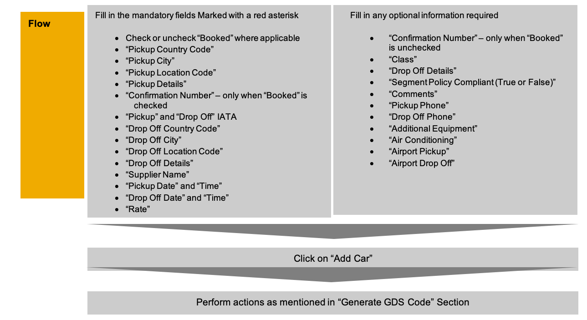

PUBLIC

# Data Formatter for Concur Request

# V3.1

This file has been created to assist TMCs with documenting proposals back to a GDS Container PNR as part of the Agency Proposal Powered by Compleat flow.

This file will ensure accuracy when entering the remark lines into the GDS Container PNR and help provide all the mandatory elements to Travel Request.

**Table of ContentS**

**[CONFIGURATION 3](#_Toc94552475)**

**[generate gds code Section 4](#_Toc94552476)**

**[GENERAL Section 5](#_Toc94552478)**

**[General section completion flow 5](#_Toc94552479)**

**[General Section screenshot example 5](#_Toc94552480)**

**[General Section table of definitions 6](#_Toc94552481)**

**[General Section mandatory information 6](#_Toc94552482)**

**[General Section optional information 7](#_Toc94552483)**

**[AIR TAB 8](#_Toc94552484)**

**[Air Tab completion flow 8](#_Toc94552485)**

**[Air Tab screenshot example 8](#_Toc94552489)**

**[Air Tab table of definitions 9](#_Toc94552490)**

**[Air Tab mandatory information 9](#_Toc94552491)**

**[Air Tab optional information 10](#_Toc94552492)**

**[CAR TAB 11](#_Toc94552493)**

**[Car Tab completion flow 11](#_Toc94552494)**

**[Car Tab screenshot example 11](#_Toc94552495)**

**[Car Tab table of definitions 12](#_Toc94552496)**

**[Car Tab mandatory information 12](#_Toc94552497)**

**[Car Tab optional information 13](#_Toc94552498)**

**[HOTEL TAB 15](#_Toc94552499)**

**[Hotel Tab completion flow 15](#_Toc94552500)**

**[Hotel Tab screenshot example 15](#_Toc94552501)**

**[Hotel Tab table of definitions 16](#_Toc94552502)**

**[Hotel Tab mandatory information 16](#_Toc94552503)**

**[Hotel Tab optional information 17](#_Toc94552504)**

**[RAIL TAB 18](#_Toc94552505)**

**[Rail Tab completion flow for one-way rail 18](#_Toc94552506)**

**[Rail Tab one-way screenshot example 18](#_Toc94552507)**

**[Rail Tab one-way table of definitions 19](#_Toc94552508)**

**[Rail Tab one-way mandatory information 19](#_Toc94552509)**

**[Rail Tab one-way optional information 20](#_Toc94552510)**

**[SEGMENT COUNTERS: 21](#_Toc94552511)**

**[CONCATENATION 21](#_Toc94552512)**

**[REMARK SEPARATORS 22](#_Toc94552513)**

**[VERSION HISTORY 23](#_Toc94552514)**

#

# CONFIGURATION

The "Data Formatter for Concur Request" file has been programmed to perform a concatenation of the remarks generated to allow for more than one remark line to be copied at a time.

**The remarks order must be respected in order to have a successful PNR transmission to Request.**

The configuration for the concatenation varies depending on the tool used to interact with the GDS and the GDS itself. We have therefore allowed for updates to the concatenation character and the number of instances in the output block.

For more information on concatenation use and output examples, please see the [Concatenation](#_CONCATENATION_1) section below.

Prior to implementation, please determine the correct character and instances for your tool and GDS.

To edit the character and instances:

- Save the file
- Right click the file, and "open with" any document editor.

You will see the following at the beginning of the document:

/\*\*\*\*\*\*\*\*\*\*\*\*\*\*\*\*\*\*\*\*\* Concatenation Variables \*\*\*\*\*\*\*\*\*\*\*\*\*\*\*\*\*\*\*\*\*\*\*/

// Concatenation Characters for each gds

concatStringApollo = "+"

concatStringAmadeus = ";"

concatStringGalileo = "+"

concatStringSabre = "&"

concatStringWorldspan = "#"

// Number of Concatenations for each Gds

lineLimitApollo = 8

lineLimitAmadeus = 8

lineLimitGalileo = 28

lineLimitSabre = 79

lineLimitWorldspan = 80

/\*\*\*\*\*\*\*\*\*\*\*\*\*\*\*\*\*\*\*\*\* Declaring GDS Array \*\*\*\*\*\*\*\*\*\*\*\*\*\*\*\*\*\*\*\*\*\*\*/

const constGDS = ['Apollo','Amadeus','Galileo','Sabre','Worldspan'];

const defaultGDS ="Sabre";

const constSegCount = 99;

- To update the character, amend the concatString value inside " "

- To amend the number of concatenation instances, amend the lineLimit value after =[space]

- To amend the Default GDS amend the defaultGDS value after =[space] with one of GDS values provided in the constGDS array

- To amend the maximum segments that can be created amend the constSegCount value after =[space] with a number

- Save the changes

- Test the output against your GDS interaction tool, ensuring that the maximum value of instances is achieved

# generate gds code Section

This section is used to Generate GDS code for all the segments including General Remarks.

# 

#

# 

#

This step must be performed after Adding All the segments. This section generates PNR command for all the segments including General Remarks.

#

#

# GENERAL Section

This section is used to add mandatory information remarks to the GDS Container PNR.

N.B. This document uses Apollo remarkexamples only.

## General section completion flow

## General Section screenshot example

This step must be performed for each proposalbefore adding the related segment remark data into the PNR.

## General Section table of definitions

### General Section mandatory information

| **File input** and description | **PNR Remark label**
 | **PNR Remark example**
 |
| --- | --- | --- |
|
| |
| (1) Locator
This is the record locator of the container PNR that the customer will use in any communication. It can be either the GDS Container PNR locator or the locator of an additional booking. | LOC- | LOC-2NCMIA |
| --- | --- | --- |
| (2) Select a GDS
This is where you choose the GDS (in our example Apollo) needed to generate the Container PNR. | Drop down choice on file | @:5P/APTR… |
| (3) Select a Proposal Number
This is where you select the proposal number (3 is the maximum).Each proposal must be entered in turn. After each is completed (and copied and pasted) the data for the next proposal can be updated. | PROP1 | @:5P/APTR/54/PROP1/… |
| (4) General
This tab is used to fill in the general information that is needed for the GDS Container PNR. | GEN | @:5P/APTR/54/PROP1/GEN/… |

###

### General Section optional information

| **File input** and description | **PNR Remark label**
 | **PNR Remark example** with default values |
| --- | --- | --- |
|
| |
| Proposal Expiry Date
This is the expiry date and time of the proposal.
- Date is in the format DD/MMM/YYYY
- Time is in the format HHMM and is 24 hours
 | LIMIT-
T- | LIMIT-2023-03-31
T102500.000
(shows as LIMIT-/ if blank) |
| --- | --- | --- |
|
| |
| Agency Branch Offset to GMT/UTC
This is the agency branch time zone.This works in conjunction with the Proposal Expiry so that the correct time can be applied adjusting any offset.Select if the Offset is MINUS or PLUS GMT/UTC
- Date is in the format DD/MMM/YYYY
- Time is in the format HHMM and is 24 hours
 | ZPLUS | ZPLUS0000
(not shown if blank) |
|
| |
| Remarks
This is a free text field for any additional information. | RMKS- | RMKS-GENERAL TAB COMMENTS FREE TEXT
(shows as RMKS-/ if blank) |
| Booked
Select this option if you have pre-booked a proposal for policy compliance reasons. This will be shown to the traveller in the next version of Agency Proposal user interface v2.
The default is unchecked
 | BKD- | BKD-FALSE(default value) |

## AIR TAB

This is where you complete the details for a single or return or multi-Air segment.

This will be the landing page when the file is opened.

### Air Tab completion flow

Perform actions as mentioned in "Generate GDS Code" Section

### Air Tab screenshot example

N.B. The summary of each segment will be displayed as a row under the "Total Air Segments". The segment counter will be incremented once each segment is added

## Air Tab table of definitions

### Air Tab mandatory information

| **File input** and description | **PNR Remark label**
 | **PNR Remark example**
 |
| --- | --- | --- |
|
| |
| AIR – One Way
This is the Air segment tab to fill in the information for | SEG- | SEG-AIR1 |
| --- | --- | --- |
| (1) Total Air Fare For All Segments
This is the total amount for all the Air segments added in the Air Tab.It will automatically format to 2 decimal places if not typed.We currently only support decimalized currencies | VAL- | VAL-215.00 |
| (2) Departure IATA
This is the three-letter IATA airport code for the departure. | SIATA | SIATA-LHR |
| (3) Arrival IATA
This is the three-letter IATA airport code for the arrival. | EIATA | EIATA-CDG |
| (4) Flight Number
This is the flight number and should be:the airline two-letter IATA code followed by the flight number | FN-
 | FN-BA258

 |
| (5) Confirmation Number
This is where you will add the provider reference if you have selected "Booked".This is only mandatory when Booked is checked | CONF- | CONF-ABCDEF
CONF-NA(default value if blank) |
| (6) Departure Date and Time (7) Arrival Date and Time
This should be entered using the following format:
- Date is in the format DD/MMM/YYYY
- Time is in the format HHMM and is 24 hours
 | SDTE-…/AT-EDTE-…/AT- | SDTE-2021-09-07/AT-0920EDTE-2021-09-07/AT-1130 |
| (8) Airline Class
This is the cabin class description in full. | C- | C-ECONOMY |

### Air Tab optional information

| **File input** and description | **PNR Remark label**
 | **PNR Remark example** |
| --- | --- | --- |
|
| |
| Booked
Select this if the flight is booked (eg low-cost carrier). | BKD-

 | BKD-TRUEorBKD-FALSE(default value) |
| --- | --- | --- |
|
| |
| Confirmation Number
 This is where you will add the provider reference if applicable.This is optional when "Booked" is not selected. | CONF-
 | CONF-ABCDEF
CONF-NA(default value if blank) |
|
| |
| Flight Duration
This is the flight duration information in minutes. | DUR- | DUR-150
(shows as DUR-/ if blank) |
|
| |
| Departure Terminal
This is where you add the departure terminal information. | TD- | TD-NORTH
(not shown if blank) |
| Arrival Terminal
This is where you add the arrival terminal information. | TA- | TA-SOUTH
(not shown if blank) |
| Segment Policy Complaint
This will be a Boolean value True or False | CMPL- | CMPL-TRUE
(not shown if not selected) |
| Comments
 This is where any additional comments related to the air segment can be added. For example, the fare conditions or any information that you want to pass to the traveller. It is free text. | RMKS- | RMKS-AIR COMMENTS TEST
(not shown if blank) |
| Seat Number
This is where you add the seat number. It is free text. | SEAT- | SEAT-2C
(not shown if blank) |
| Equipment
This is where you add the equipment information if available. | EQP- | EQP-757
(not shown if blank) |

## CAR TAB

This is where all the details regarding the information for a Car segment should be added.

## Car Tab completion flow

## Car Tab screenshot example

N.B. The summary of each segment will be displayed as a row under the "Total Car Segments". The segment counter will be incremented once each segment is added

## Car Tab table of definitions

## Car Tab mandatory information

| **File input** and description | **PNR Remark label**
 | **PNR Remark examples**
 |
| --- | --- | --- |
|
| |
| CAR
This is the tab and the segment type. | SEG- | SEG-CAR |
| --- | --- | --- |
| (1) Pickup Country Code
This is the pickup two-letter IATA country code. | SCO- | SCO-FR |
| (2) Pickup City
This is the pickup city name in full. | SCITY- | SCITY-PARIS
 |
| (3) Pickup Location Code
This is the UN Location Code | SCODE- | SCODE-FRPLD |
| (4) Pickup Details
This is where you enter the details about the pickup. | SNOTE- | SNOTE-RAIL STATION |
| (5) Confirmation Number
This is where you will add the provider reference if you have selected "Booked".This is only mandatory when "Booked" is checked | CONF- | CONF-ABCDEF
CONF-NA(default value if blank) |
| (6) Pickup IATA
This is the three-letter city code of the pickup city. | SIATA- | SIATA-PAR
(not shown if blank) |
| (7) Drop Off Country Code
This is the drop off two-letter IATA country code. | ECO- | ECO-FR |
| (8) Drop Off City
This is the drop off city name in full. | ECITY- | ECITY-LYON |
| (9) Drop Off Location Code
This is the UN Location Code | ECODE- | ECODE-FRLYS |
| (10) Drop Off Details
This is where you can add any information regarding the drop off. | ENOTE- | ENOTE-AT HILTON RECEPTION |
| (11) Supplier Name
This is the supplier name in full. | SUP- | SUP-AVIS |
| (12) Drop Off IATA
This is the three-letter city code of the drop off city. | EIATA- | EIATA-LYS
(not shown if blank) |
| (13) Pickup Date and Time
This is the pickup date and time using the following format:
- Date is in the format DD/MMM/YYYY
- Time is in the format HHMM and is 24 hours
 | SDTE-…/AT-… | SDTE-2023-11-17/AT-1200 |
| (14) Drop Off Date and Time
This is the drop off date and time using the following format:
- Date is in the format DD/MMM/YYYY
- Time is in the format HHMM and is 24 hours
 | EDTE-…/AT-… | EDTE-2023-11-17/AT-1430 |
| (15) Rate
This is the total amount of the Car segment.It will automatically format to 2 decimal places if not typed.We currently only support decimalized currencies. | VAL- | VAL-150.00 |

### Car Tab optional information

| **File input** and description | **PNR Remark label**
 | **PNR Remark examples** with default values |
| --- | --- | --- |
|
| |
| Booked
If you have booked the car and selected this field, the "Confirmation Number" will become mandatory.
 | BKD-

 | BKD-TRUE orBKD-FALSE(default value)
 |
| --- | --- | --- |
| Confirmation Number
This is where you enter the booking reference obtained from the provider if applicable.
This is optional when "Booked" is not selected. | CONF- | CONF-14545orCONF-NA(default value)
 |
| Class
This is where you add the car category in full. | C- | C-COMPACT
(not shown if blank) |
| Segment Policy Compliant (True or False)
This will be a Boolean value True or False | CMPL- | CMPL-True
(not shown if blank) |
| Comments
This is where you can add any free text additional information regarding the car segment. | RMKS- | RMKS-CAR COMMENT EXAMPLE
(not shown if blank) |
| Transmission Preference
This is where you choose the car transmission in the drop-down menu. | TRAN- | TRAN-A(default value) |
| Pickup Phone
Here you can enter the pickup office phone number. | PUPH- | PUPH-1233333333
(not shown if blank) |
| Drop Off Phone
Here you can enter the drop off office phone number. | DOPH- | DOPH-415747777
(not shown if blank) |
| Additional Equipment
This is where you can add any car feature/equipment required. It is free text. | EQP- | EQP-SAT NAV(not shown if blank) |
| Air Conditioning
Select from the drop-down as preferred. | AC- | AC-TRUE(default is FALSE) |
| Airport Pickup
This is a drop-down menu where you select if the pickup will be at the airport or not. | PU- | PU-FALSE(default value) |
| Airport Drop Off
This is a drop-down menu where you select if the drop off will be at the airport or not. | DO- | DO-TRUE(default is FALSE) |

# HOTEL TAB

This is where all the details regarding the proposal for a Hotel segment are added.

## Hotel Tab completion flow

## Hotel Tab 

N.B. The summary of each segment will be displayed as a row under the "Total Hotel Segments". The segment counter will be incremented once each segment is added

## Hotel Tab table of definitions

### Hotel Tab mandatory information

| **File input** and description | **PNR Remark label**
 | **PNR Remark examples**
 |
| --- | --- | --- |
|
| |
| HOTEL
This is the tab name and the segment type. | SEG- | SEG-HOT |
| --- | --- | --- |
| (1) Country Code
This is the destination two-letter country code. | SCO- | SCO-GB |
| (2) Destination City
This is the destination city name in full | SCITY- | SCITY-LONDON |
| (3) Destination Location Code
This is the UN Location Code for Destination | SCODE- | SCODE-GBLHR |
| (4) Destination IATA
This is the IATA three-letter code of the destination city. | SIATA-
 | SIATA-LHR

 |
| (5) Hotel Name
This is where you enter the hotel name. | HTLNAME- | HTLNAME-LEA PALACE |
| (6) Check-In Date and Time
This is the check-in date and time using the following format:
- Date is in the format DD/MMM/YYYY
- Time is in the format HHMM and is 24 hours
 | SDTE-…/AT- | SDTE-2023-11-17/AT-1520 |
| (7) Check-Out Date and Time
This is the check-out date and time using the following format:
- Date is in the format DD/MMM/YYYY
- Time is in the format HHMM and is 24 hours
 | EDTE-…/AT- | EDTE-2023-11-20/AT-1200 |
| (8) Confirmation Number
This is where you will add the provider reference if you have selected "Booked".
This is only mandatory when Booked is checked. | CONF- | CONF-ABCDEF
CONF-NA(default value if blank) |
|
| |
| (9) Supplier Name
This is where you enter the supplier name in full. | SUP- | SUP-SHERATON |
|
| |
| (10) Rate
This is the total amount of the Hotel segment.It will automatically format to 2 decimal places if not typed.We currently only support decimalized currencies. | VAL- | VAL-125.20 |

Hotel Tab optional information

| **File input** and description | **PNR Remark label**
 | **PNR Remark examples** with default value information |
| --- | --- | --- |
|
| |
| Booked
If you check "Booked", the "Confirmation Number" field will become mandatory.
 | BKD-

 | BKD-FALSE (default value)

 |
| --- | --- | --- |
| Confirmation NumberThis is where you add the provider confirmation number if the hotel has been booked directly with the provider.
This is optional when "Booked" is not selected. | CONF- | CONF-A123456orCONF-NA(default value) |
| Location Details
This is a free text field where you can add information about the hotel location. | NOTE- | NOTE-DOWNTOWN
(not shown if blank) |
| Hotel Address
This is where you add the hotel address information. | ADD- | ADD-ASTON ROAD, LONDON
(not shown if blank) |
| Hotel Zip Code
This is the zip code of the hotel location | ZIP- | ZIP-LW45 6ER
(not shown if blank) |
| Phone Number
This is where you add the hotel phone number | PH- | PH-0044 1256321
(not shown if blank) |
| Segment Policy Compliant (True or False)
This will be a Boolean value True or False | CMPL- | CMPL-True
(not shown if blank) |
| Room Type
This is where you can enter the room type in full.It is free text. | ROOM- | ROOM-DOUBLE
(not shown if blank) |
| Comments
This is where you can add any additional comments such as cancellation policy. | RMKS- | RMKS-24HR CXX POLICY
(not shown if blank) |

## RAIL TAB

This is where all the details regarding the rail segment are added.

## Rail Tab completion flow for one-way rail

## Rail Tab one-way screenshot example

N.B. The summary of each segment will be displayed as a row under the "Total Rail Segments". The segment counter will be incremented once each segment is added

## Rail Tab one-way table of definitions

### Rail Tab one-way mandatory information

| **File input** and description | **PNR Remark label**
 | **PNR Remark examples**
 |
| --- | --- | --- |
|
| |
| RAIL – One Way
This is the tab name and the segment type. | SEG- | SEG-RAIL1 |
| --- | --- | --- |
| (1) Booked
Check the field "Booked" if you have confirmed the booking with the provider. The "Confirmation Number" field will then become mandatory. | BKD- | BKD-FALSE (default value)
 |
| (2) Fare
This is the total amount of the rail segment.It will automatically format to 2 decimal places if not typed.We currently only support decimalized currencies. | VAL- | VAL-250.00 |
| (3) Booking Source
This is the rail provider booking source. It is a drop-down menu of the supported providers. | STYPE- | STYPE-SNCF |
| (4) Departure Country Code
This is the two-letter IATA departure country code. | SCO- | SCO-FR |
| (5) Departure Station Name
This is the departure station name from the drop down provided and includes the departure rail station code. Items in the list are supplier specific. | CODE-
NAME- | CODE-FRDHP
NAME-PARIS MONTPARNASSE 2 PASTEUR |
| (6) Confirmation Number
This is where you will add the provider reference if you have selected "Booked". This is only mandatory when Booked is checked. | CONF- | CONF-A123456orCONF-NA(default value) |
|
| |
| (7) Arrival Country Code
This is the two-letter IATA arrival country code. It is a drop-down menu. | CO- | CO-GB |
|
| |
| (8) Arrival Station Name
This is the arrival station name from the drop down provided and includes the rail station code. Items in the list are supplier specific. | CODE-
NAME- | CODE-GBBLL
NAME-BLACKFRIARS LONDON |
|
| |
| (9) Carrier NameThis is the carrier name in full. | SUP- | SUP-EUROSTAR |
| (10) Departure Date and Time
This is the departure date and time using the following format:
- Date is in the format DD/MMM/YYYY
- Time is in the format HHMM and is 24 hours
 | DTE-…/AT- | DTE-2023-11-19/AT-0850 |
|
| |
| (11) Arrival Date and Time
This is the arrival date and time using the following format:
- Date is in the format DD/MMM/YYYY
- Time is in the format HHMM and is 24 hours
 | DTE-…/AT- | DTE-2023-11-19/AT-1100 |

### Rail Tab one-way optional information

| **File input** and description | **PNR Remark label**
 | **PNR Remark examples** with default value information |
| --- | --- | --- |
|
| |
| Booked
Check the field "Booked" if you have confirmed the booking with the provider. "Confirmation Number" field will then become mandatory | BKD-

 | BKD-FALSE (default value)

 |
| --- | --- | --- |
|
| |
| Confirmation NumberThis is where you add the provider confirmation number if applicable. This is optional if "Booked" is not checked. | CONF- | CONF-A12345orCONF-NA(default value) |
| Class of Services
This is the class of services in full. | C- | C-STANDARD
(not shown if blank) |
| Duration
This is the trip duration in minutes. | DUR- | DUR-280
(shows as DUR-/ if blank) |
| Train Number
This is where you add the train number. | TRN- | TRN-4
(not shown if blank) |
| Wagon Number
This is where you add the wagon number. | WAG- | WAG-8
(not shown if blank) |
| Seat Number
This is where you add the seat number. | SEAT- | SEAT-1C
(not shown if blank) |
| Segment Policy Compliant (True or False)
This will be a Boolean value True or False | CMPL- | CMPL-True
(not shown if blank) |
| Comments
This is where you add any free text information. | RMKS- | RMKS-QUIET ZONE AVAILABLE
(not shown if blank) |

##

## SEGMENT COUNTERS:

- From this version we have added a new feature which keeps track of number of segments added for each tab - air/car/hotel/rail
- The "Total Segments created" counter indicates Total number of segments created.
- The limit on Total number of segments to be created will be set in the variable " **constSegCount**"

##

## CONCATENATION

Remark concatenation allows for multiple remark lines to be copied in a single block. Where the maximum number of concatenations has been reached, a new remark block will be created. This ensures that the minimum number of copy and paste actions is required.

For more information on configuring concatenation, please see [Configuration](#_CONFIGURATION_6) above.

Example of blocks:

@:5P/APTR/54/PROP1/GEN/LIMIT-2023-03-31T102500.000ZPLUS0000+@:5P/APTR/27/PROP1/GEN/BKD-FALSE+@:5P/APTR/53/PROP1/GEN/RMKS-GENERAL TAB COMMENTS FREE TEXT+@:5P/APTR/28/PROP1/GEN/LOC-2NCMIA

@:5P/APTR/55/PROP1/SEG-AIR1/BKD-FALSE/RMKS-AIR COMMENTS TEST+@:5P/APTR/46/PROP1/SEG-AIR1/SDTE-2023-11-17/ST-0930+@:5P/APTR/57/PROP1/SEG-AIR1/EDTE-2023-11-17/ET-1130/PNR-2NCMIA+@:5P/APTR/44/PROP1/SEG-AIR1/CMPL-TRUE/CONF-ABCDEF+@:5P/APTR/40/PROP1/SEG-AIR1/C-ECONOMY/DUR-150+@:5P/APTR/39/PROP1/SEG-AIR1/FN-BA258/SEAT-2C+@:5P/APTR/32/PROP1/SEG-AIR1/SIATA-LHR+@:5P/APTR/32/PROP1/SEG-AIR1/EIATA-CDG+@:5P/APTR/30/PROP1/SEG-AIR1/EQP-757

@:5P/APTR/40/PROP1/SEG-AIR1/TD-NORTH/TA-SOUTH+@:5P/APTR/42/PROP1/SEG-AIR1/CURR-USD/VAL-0.00

@:5P/APTR/32/PROP1/SEG-AIR2/BKD-FALSE+@:5P/APTR/52/PROP1/SEG-AIR2/RMKS-RETURN AIR COMMENTS TEST+@:5P/APTR/46/PROP1/SEG-AIR2/SDTE-2023-11-20/ST-0930+@:5P/APTR/57/PROP1/SEG-AIR2/EDTE-2023-11-20/ET-1130/PNR-2NCMIA+@:5P/APTR/44/PROP1/SEG-AIR2/CMPL-TRUE/CONF-ABDDEE+@:5P/APTR/40/PROP1/SEG-AIR2/C-ECONOMY/DUR-150+@:5P/APTR/39/PROP1/SEG-AIR2/FN-BA258/SEAT-2C+@:5P/APTR/32/PROP1/SEG-AIR2/SIATA-CDG+@:5P/APTR/32/PROP1/SEG-AIR2/EIATA-LHR

@:5P/APTR/30/PROP1/SEG-AIR2/EQP-757+@:5P/APTR/40/PROP1/SEG-AIR2/TD-SOUTH/TA-NORTH+@:5P/APTR/42/PROP1/SEG-AIR2/CURR-USD/VAL-215.00

@:5P/APTR/57/PROP1/SEG-CAR1/BKD-FALSE/RMKS-CAR COMMENT EXAMPLE+@:5P/APTR/34/PROP1/SEG-CAR1/CONF-ABCDEF+@:5P/APTR/46/PROP1/SEG-CAR1/SDTE-2023-11-17/ST-1200+@:5P/APTR/46/PROP1/SEG-CAR1/EDTE-2023-11-17/ET-1430+@:5P/APTR/34/PROP1/SEG-CAR1/SCODE-FRPLD+@:5P/APTR/34/PROP1/SEG-CAR1/ECODE-FRLYS+@:5P/APTR/43/PROP1/SEG-CAR1/PNR-2NCMIA/CMPL-TRUE+@:5P/APTR/31/PROP1/SEG-CAR1/SUP-AVIS+@:5P/APTR/51/PROP1/SEG-CAR1/SCO-FR/SCITY-PARIS/SIATA-PAR

@:5P/APTR/50/PROP1/SEG-CAR1/ECO-FR/ECITY-LYON/EIATA-LYS+@:5P/APTR/30/PROP1/SEG-CAR1/AC-TRUE+@:5P/APTR/29/PROP1/SEG-CAR1/TRAN-A+@:5P/APTR/32/PROP1/SEG-CAR1/C-COMPACT+@:5P/APTR/38/PROP1/SEG-CAR1/PUPH-1233333333+@:5P/APTR/37/PROP1/SEG-CAR1/DOPH-415747777+@:5P/APTR/51/PROP1/SEG-CAR1/PU-FALSE/DO-TRUE/EQP-SAT NAV+@:5P/APTR/41/PROP1/SEG-CAR1/SNOTE-RAIL STATION+@:5P/APTR/48/PROP1/SEG-CAR1/ENOTE-AT HILTON RECEPTION

@:5P/APTR/42/PROP1/SEG-CAR1/CURR-USD/VAL-150.00

@:5P/APTR/54/PROP1/SEG-HOT1/BKD-FALSE/RMKS-24HR CXX POLICY +@:5P/APTR/34/PROP1/SEG-HOT1/CONF-ABCDEF+@:5P/APTR/43/PROP1/SEG-HOT1/SDTE-2023-11-17/ST-/+@:5P/APTR/43/PROP1/SEG-HOT1/EDTE-2023-11-20/ET-/+@:5P/APTR/34/PROP1/SEG-HOT1/SCODE-GBLHR+@:5P/APTR/43/PROP1/SEG-HOT1/PNR-2NCMIA/CMPL-TRUE+@:5P/APTR/35/PROP1/SEG-HOT1/SUP-SHERATON+@:5P/APTR/52/PROP1/SEG-HOT1/SCO-GB/SCITY-LONDON/SIATA-LHR+@:5P/APTR/41/PROP1/SEG-HOT1/HTLNAME-LEA PALACE

@:5P/APTR/34/PROP1/SEG-HOT1/ROOM-DOUBLE+@:5P/APTR/38/PROP1/SEG-HOT1/PH-0044 1256321+@:5P/APTR/36/PROP1/SEG-HOT1/NOTE-DOWNTOWN+@:5P/APTR/42/PROP1/SEG-HOT1/CURR-USD/VAL-125.20+@:5P/APTR/45/PROP1/SEG-HOT1/ADD-ASTON ROAD, LONDON+@:5P/APTR/35/PROP1/SEG-HOT1/ZIP-LW45 6ER

@:5P/APTR/33/PROP1/SEG-RAIL1/BKD-FALSE+@:5P/APTR/50/PROP1/SEG-RAIL1/RMKS-QUIET ZONE AVAILABLE +@:5P/APTR/36/PROP1/SEG-RAIL1/CONF-A123456+@:5P/APTR/47/PROP1/SEG-RAIL1/SDTE-2023-11-19/ST-0850+@:5P/APTR/47/PROP1/SEG-RAIL1/EDTE-2023-11-19/ET-1100+@:5P/APTR/44/PROP1/SEG-RAIL1/PNR-2NCMIA/CMPL-TRUE+@:5P/APTR/36/PROP1/SEG-RAIL1/SUP-EUROSTAR+@:5P/APTR/51/PROP1/SEG-RAIL1/SCO-FR/SCODE-FRDHP/STYPE-2C+@:5P/APTR/57/PROP1/SEG-RAIL1/NAME-PARIS MONTPARNASSE 2 PASTEUR

@:5P/APTR/51/PROP1/SEG-RAIL1/ECO-GB/ECODE-GBBLL/ETYPE-2C+@:5P/APTR/47/PROP1/SEG-RAIL1/NAME-BLACKFRIARS LONDON+@:5P/APTR/43/PROP1/SEG-RAIL1/CURR-USD/VAL-250.00+@:5P/APTR/42/PROP1/SEG-RAIL1/C-STANDARD/DUR-280+@:5P/APTR/35/PROP1/SEG-RAIL1/TRN-4/WAG-8+@:5P/APTR/31/PROP1/SEG-RAIL1/SEAT-1C

# REMARK SEPARATORS

Remark entries use a single forward slash between fields but may also contain a double forward slash for long remark content.

The single forward slash **/** denotes the end of a field and the beginning of the next field.

Aforward slash **/** is a **reserved character** and should **not** be added in any field.

The double forward slash **//** denotes that the content is longer than the line length permitted by the GDS. The remaining content is then split into a new entry or entries with no label. The number of splits will depend on how many are required.

Double slash example:

@:5P/APTR/54/PROP1/SEG-AIR2/RMKS- **COMMENTS FOR THE RETURN**

//+@:5P/APTR/34/PROP1/SEG-AIR2/ **AIR SEGMENT**

# VERSION HISTORY

| **Data Formatter for Concur Request Version Number** | **Amendments dates**
 |
| --- | --- |
|
| |
| V2.10

v2.11

v2.12

v2.12.1

v2.12.2
 | **02Jun21** ALL TABS :
- Time - can now be entered manually only
- Date - user can manually enter the date or use the calendar

AIR, CAR, HOTEL and RAIL TABS:
- Fare/Rate - two decimals will be added automatically if not entered in the corresponding field
- Policy compliance - accept only numeric value between 0 and 100

AIR and RAIL TABS:
- Policy compliance - will now show for each leg in case of return trips

AIR TAB:
- Departure/Arrival Details - Mandatory and Optional information are now on the same block for the air one-way segment
- Return Details - Mandatory and optional information are now on the same block

RAIL TAB:
- Departure/Arrival Details - Mandatory and optional information are now on the same block for the rail one-way segment
- Return Details - Mandatory and optional information are now on the same block

CAR TAB:
- Drop Off Details - this field is now optional

OPTIONAL INFORMATION
- We will show the data in the remarks only if the value is entered in the file.(please refer to each optional field for each segment

**07Jun21** CAR TAB
- Location data has now been added
- Drop Off Details is now optional

ALL TABS
- Currency fields will now accept only alpha characters

AIR and RAIL TAB
- For return trips we have now all the information boxes on the same page

GENERATE CODE
- Introduction of the concatenation of the remarks

**28Jun21**
- Concatenation has been implemented
- Bug fixes (Hotel Phone now populated in the remarks when added, double "/" in the car remarks)

**30Jun21**
- File name has been updated
- UI updates (adding "Return" before "Confirmation number" and "Policy Compliance Level" fields)

**03Aug21**
- Airline name removed from One Way and Return
 |
| --- | --- |

| **Data Formatter for Concur Request Version Number** | **Amendments dates**
 |
| --- | --- |
|
| |
| V3.0

 | **31Jan22** ALL TABS :
- Currency removed from all tabs and moved to common section as a single field
GENERAL TAB:
- General tab is removed, and all the fields are moved to common section.

AIR, CAR, HOTEL and RAIL TABS:
- Meals has been removed from Air Tab
- Option to Add multiple segments for each tab
- Multi city segment feature has been added
- Added segment counters for each tab.

Generate GDS code Section:
- This section enables to generate code for each GDS without reentering values for each segment.

 |
| --- | --- |
|
| |
| V3.1 | **01MAR23** ALL TABS :
- Policy compliant level field is renamed to "Segment Policy Compliant" and is now Boolean value (True or False).

 |

N.B. This document v3.1 is a guide for the file v3.3 and supersedes any previous documentation

